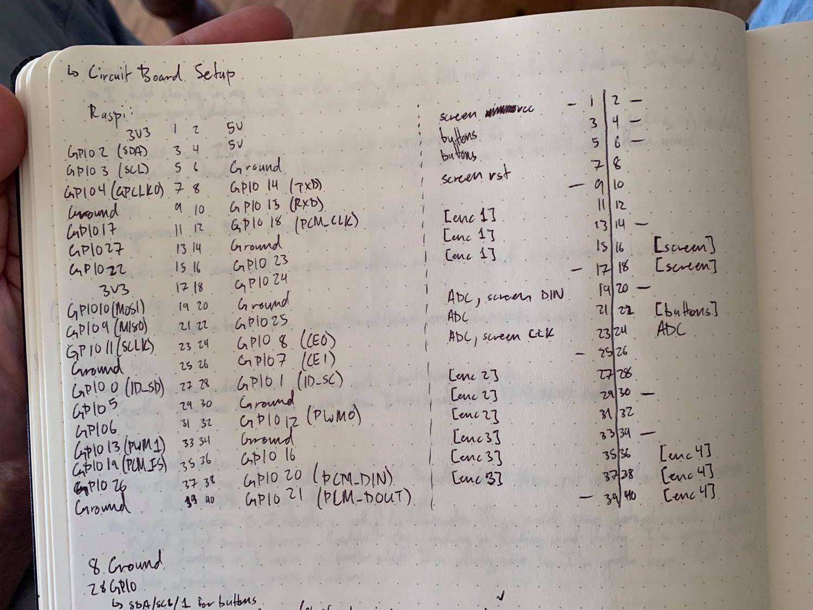

## Pie GPIO Block Note

- dash is ground or power
- [] changeable gpio pin

# Ideas for connecting multiple sub boards together
- https://www.amazon.com/WayinTop-Connector-Crimping-Crimper-Terminals/dp/B07JG8HVLG/ref=sr_1_2?dchild=1&keywords=ribbon+cable+jumper+make&qid=1621726939&sr=8-2
- 
